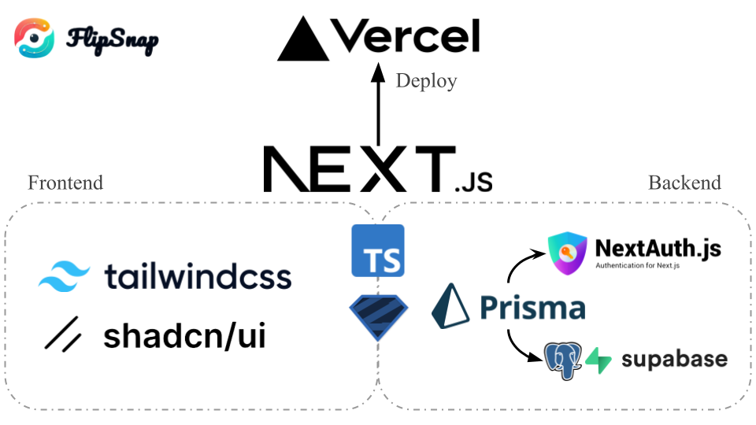

    
    <h1 align="center">FlipSnap by HiKs</h1>
    

    Two Sides, One Post. Share the Moment Behind the Moment.
    

# Introduction
Welcome to FlipSnap, the photo-sharing social networking service that redefines how we share moments. FlipSnap allows users to post photos in pairs, each with a public side and a private side. While the public side is open for everyone to view, the private side requires mutual following, ensuring a more intimate sharing experience with friends and family. This unique approach allows users to enjoy the benefits of both public sharing and private communication in a single post, creating a new and exciting way to connect and share memories.

パブリック性とクローズド性を兼ね備えた写真共有SNS。写真は表/裏の2枚1組で投稿し，表は誰でも閲覧可能だが，裏は相互フォローでないと閲覧できない。表ではオープンに発信しつつも、裏ではプライベートな共有ができる。1つの投稿で公開性と閉鎖性を両立させ，新たな体験価値を創出する。

# Tech Stack
<!--  -->

フロントエンドはNext.jsベースでtailwindcssやFramerMotionなどで構築，
バックエンドはNode.jsベースでPrisma+Postgres, Redisなどで構築している。

# Authors
A list of the original co-authors.
- From [team HiKs](https://github.com/team-hiks)
    - 坂　功弥 (Koya Saka) - Backend - [@k7oya14](https://github.com/k7oya14)
    - 石渡　輝(Hikaru Ishiwata) - Frontend - [@hishiwat](https://github.com/hishiwat)

# History
This repo supersedes the legacy version, [FlipSnap (Legacy)](https://github.com/k7oya14/flipsnap-legacy).
